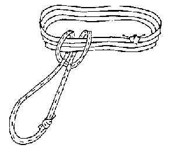
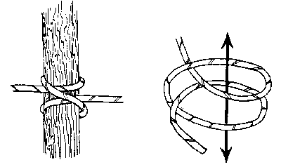
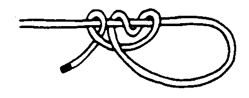
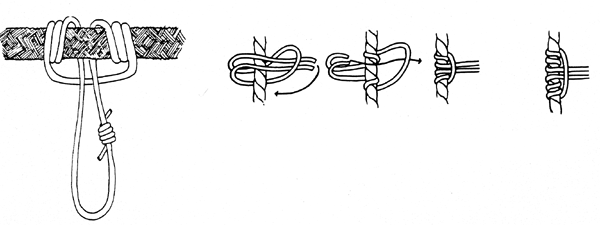
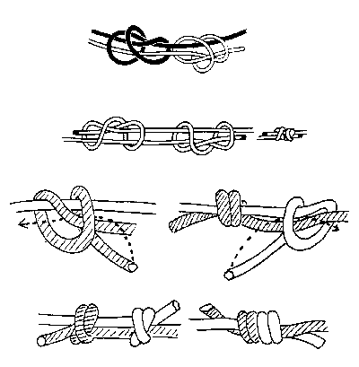
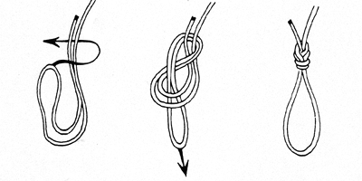
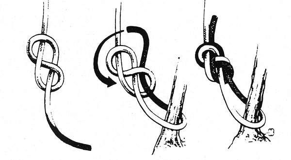
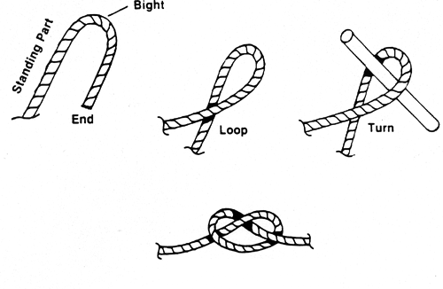
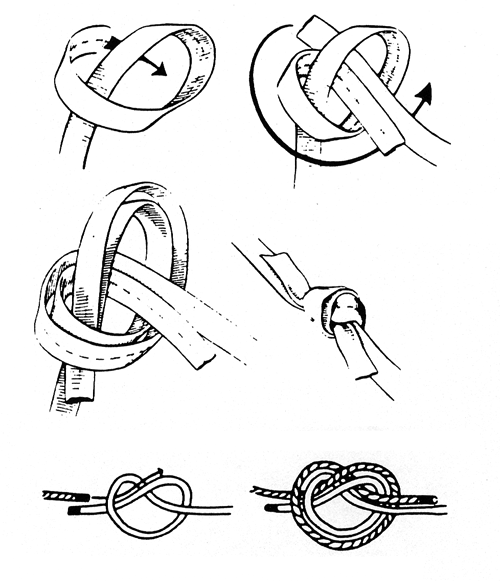

# Appendix G: Knots

# Required Knots
Patrollers are expected to know the knots and hitches listed below. For more instructions, and to view knot-tying animations, visit www.animatedknots.com.

## Girth hitch
(Image:Girthhitch.png.md)

## Clove hitch
(Image:Clovehitch.png.md)

## Taut line hitch (tent hitch)
(Image:Tenthitch.png.md)

## Prusik knot
  * Double Prusik and Triple Prusik
(Image:Prusik.png.md)

## Double fisherman's knot
(Image:doublefishermans.png.md)

## Figure-8 knot on a bight
(Image:figure8.png.md)

## Figure-8 knot rewoven
(Image:figure8rw.png.md)

## Overhand knot
(Image:overhand.png.md)

## Water knot
(Image:WaterKnot.png.md)

{{PatrolManual}}
